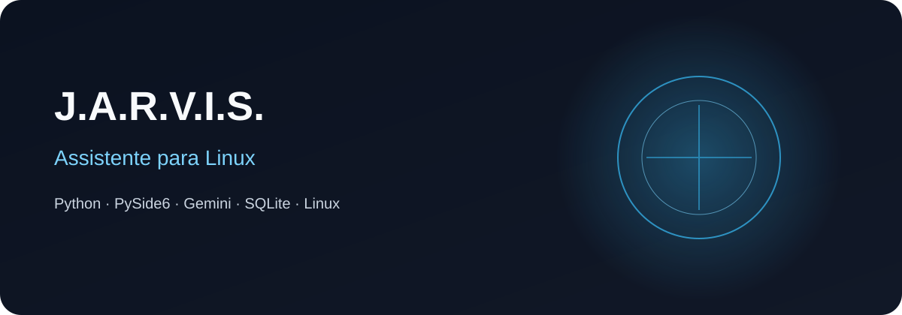
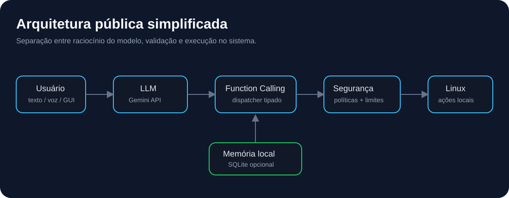
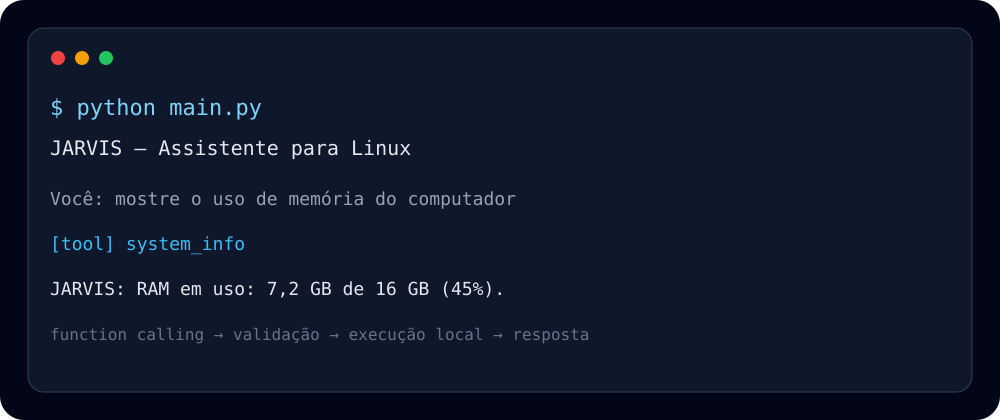

<p align="center">
  
</p>

# J.A.R.V.I.S. — Assistente Inteligente para Linux

Protótipo pessoal em evolução de um assistente para Linux que conecta **LLMs, function calling e automação local**. Esta edição foi refatorada para portfólio, removendo configurações pessoais, segredos, caminhos fixos e partes excessivamente acopladas ao computador de desenvolvimento.

> **Estado real:** esta não é a versão completa do assistente original e não deve ser apresentada como produto finalizado. Há um núcleo público funcional e sanitizado; recursos mais avançados continuam experimentais, privados ou ainda não foram portados.

## Estado do projeto

| Área | Estado |
|---|---|
| CLI, Gemini, function calling e ferramentas básicas | ✅ Implementado nesta edição |
| Memória SQLite opcional | ✅ Implementado nesta edição |
| Política básica de segurança para shell | 🧪 Implementada, mas não é sandbox formal |
| Testes | ✅ Incluídos no repositório |
| GitHub Actions | 🧪 Configurado; CI verde ainda deve ser confirmado por execução |
| GUI completa, voz, wake word, visão e automação ampla | 📋 Pertencem ao protótipo privado / não portados integralmente |

Detalhamento: [`docs/ESTADO-DO-PROJETO.md`](docs/ESTADO-DO-PROJETO.md).

## O que o projeto demonstra

- integração de IA com ferramentas locais;
- arquitetura modular em Python;
- configuração segura por variáveis de ambiente;
- execução de comandos com política de segurança;
- memória SQLite opcional e local;
- descoberta de aplicações de forma portátil;
- tratamento explícito de diferenças entre distribuições Linux;
- criação de testes e configuração de CI.

## Arquitetura

<p align="center">
  
</p>

O modelo **não executa ações diretamente**. Ele solicita uma ferramenta, o dispatcher valida a chamada e somente então uma ação local é executada.

```text
Usuário → LLM → Function Calling → Dispatcher → Política de segurança → Linux
                                              ↓
                                        resultado estruturado
                                              ↓
                                           resposta
```

Mais detalhes em [`docs/ARQUITETURA.md`](docs/ARQUITETURA.md).

## Stack

`Python 3.11+` · `Gemini API` · `SQLite` · `python-dotenv` · `psutil`

Recursos avançados como voz, interface gráfica, wake word, visão e automação de navegador pertencem ao protótipo original e estão documentados como extensões, não como funcionalidades concluídas desta edição.

## Instalação

```bash
git clone https://github.com/Jczarf/assistente-linux-jarvis.git
cd assistente-linux-jarvis

python3 -m venv .venv
source .venv/bin/activate
pip install -r requirements.txt

cp .env.example .env
# adicione sua própria GEMINI_API_KEY no arquivo .env

python main.py
```

## Configuração

```env
GEMINI_API_KEY=sua_chave_aqui
JARVIS_MODEL=gemini-2.5-flash
JARVIS_NAME=JARVIS
JARVIS_MEMORY_ENABLED=false
JARVIS_ALLOW_SHELL=false
```

A edição pública adota defaults conservadores: **memória persistente e shell genérico vêm desativados**. Eles precisam ser habilitados explicitamente.

## Compatibilidade

A camada pública evita caminhos hardcoded e tenta descobrir recursos usando `PATH`, variáveis XDG e ferramentas disponíveis no sistema.

| Ambiente | Situação |
|---|---|
| Linux Mint / Ubuntu / Debian | alvo principal |
| Fedora | funções básicas projetadas para funcionar |
| Arch Linux | funções básicas projetadas para funcionar |
| Wayland | CLI é o foco; automação gráfica depende do ambiente |
| Windows/macOS | fora do escopo atual |

Essa tabela representa **escopo de compatibilidade**, não certificação em todas as distribuições. Veja [`docs/COMPATIBILIDADE.md`](docs/COMPATIBILIDADE.md).

## Segurança

Dar ferramentas locais a um LLM exige limites explícitos. Esta versão:

- não contém chaves de API;
- não contém IPs, senhas, e-mails privados ou caminhos pessoais;
- mantém `.env` e bancos locais fora do Git;
- bloqueia padrões destrutivos conhecidos no shell;
- desativa shell por padrão;
- limita tamanho e tempo de comandos;
- recomenda confirmação humana para ações sensíveis;
- mantém dados de memória somente no computador do usuário.

Essas proteções **reduzem risco, mas não constituem uma sandbox formal**. Leia [`docs/SEGURANCA.md`](docs/SEGURANCA.md).

## Demonstração

<p align="center">
  
</p>

O visual acima é uma representação de portfólio. Um fluxo esperado da edição pública é:

```text
Você: mostre o uso de memória do computador
JARVIS: [tool: system_info]
JARVIS: retorna os dados coletados pela ferramenta local
```

## Estrutura

```text
.
├── main.py
├── jarvis/
│   ├── config.py
│   ├── core.py
│   ├── memory.py
│   ├── security.py
│   └── tools.py
├── tests/
├── assets/
├── docs/
├── .env.example
├── .gitignore
└── requirements.txt
```

## IA aplicada ao desenvolvimento

O projeto também serviu como ambiente de experimentação com desenvolvimento assistido por IA: planejamento, implementação, revisão, testes, documentação e investigação de falhas. Sugestões produzidas por agentes são tratadas como propostas e passam por revisão antes de serem incorporadas.

## Limitações conhecidas

Esta edição de portfólio não tenta replicar integralmente o ambiente privado. Integrações que dependem de hardware, desktop environment ou permissões elevadas foram deliberadamente reduzidas ou removidas para tornar o código público menor e mais auditável.

## Status

**Protótipo pessoal em evolução.** A edição pública demonstra um subconjunto sanitizado da arquitetura original e ainda exige validação contínua de compatibilidade, testes e CI.

## Autor

**Júlio Cézar**  
Estudante de Ciência da Computação · Técnico em Desenvolvimento de Sistemas

[LinkedIn](https://www.linkedin.com/in/j%C3%BAlio-c%C3%A9zar-0a26152b2/) · [GitHub](https://github.com/Jczarf)

## Uso do código

Código disponibilizado para avaliação de portfólio e estudo. Consulte [`LICENSE`](LICENSE) antes de reutilizar ou redistribuir.