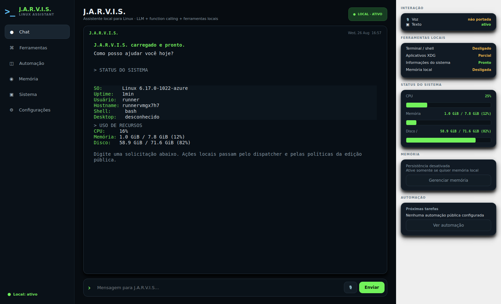

<p align="center">
  
</p>

# J.A.R.V.I.S.

Assistente desktop para Linux desenvolvido em Python. O projeto integra **Gemini 3.6 Flash**, ferramentas locais, memória SQLite opcional e uma interface em **PySide6 / Qt 6**.

<p align="center">
  
</p>

## Recursos

- chat com Gemini 3.6 Flash e function calling pela Interactions API;
- informações de CPU, memória, disco e sessão Linux;
- busca e abertura de aplicativos pelas entradas XDG;
- shell local opcional, com timeout e bloqueios básicos;
- memória persistente em SQLite;
- interface adaptável para diferentes larguras de janela;
- modo terminal com `--cli`.

## Instalação

### Requisitos

- **Python 3.12** recomendado;
- Python 3.11+ é suportado pelo projeto;
- Linux desktop para a interface gráfica;
- chave da API Gemini e conexão com a internet para o chat.

Enquanto o repositório estiver privado, use SSH se sua chave GitHub estiver configurada:

```bash
git clone git@github.com:Jczarf/assistente-linux-jarvis.git
cd assistente-linux-jarvis
./install.sh
./run.sh
```

O `install.sh` cria o `.venv`, instala as dependências e cria o `.env` a partir do exemplo quando necessário. O `run.sh` usa diretamente `.venv/bin/python`, então não é necessário ativar o ambiente virtual. Os dois scripts resolvem o diretório do projeto automaticamente e podem ser chamados por caminho absoluto.

Instalações antigas que ainda usam `JARVIS_MODEL=gemini-2.5-flash` são atualizadas pelo `install.sh` para o modelo padrão atual.

Para escolher o interpretador:

```bash
PYTHON_BIN=python3.12 ./install.sh
```

Depois da primeira instalação, adicione sua chave ao arquivo `.env`:

```env
GEMINI_API_KEY=sua_chave
```

### Instalação manual

```bash
python3.12 -m venv .venv
.venv/bin/python -m pip install .
cp .env.example .env
.venv/bin/python main.py
```

No Fish, se quiser ativar o ambiente:

```fish
source .venv/bin/activate.fish
```

Para iniciar diretamente em modo terminal:

```bash
./run.sh --cli
```

## Configuração

As principais opções ficam no `.env`:

```env
JARVIS_MODEL=gemini-3.6-flash
JARVIS_NAME=JARVIS
JARVIS_MEMORY_ENABLED=false
JARVIS_ALLOW_SHELL=false
```

Outros limites de execução e timeout estão no `.env.example`.

Memória persistente e shell ficam desativados por padrão.

## Estrutura

```text
.
├── main.py
├── install.sh
├── run.sh
├── jarvis/
│   ├── config.py
│   ├── core.py
│   ├── gui.py
│   ├── memory.py
│   ├── security.py
│   └── tools.py
├── assets/
├── .env.example
└── pyproject.toml
```

## Observação sobre o shell

A execução de comandos é opcional e possui filtros para alguns padrões destrutivos, mas não funciona como uma sandbox completa. Mantenha `JARVIS_ALLOW_SHELL=false` quando não precisar desse recurso.

## Autor

**Júlio Cézar**  
Estudante de Ciência da Computação · Técnico em Desenvolvimento de Sistemas

[LinkedIn](https://www.linkedin.com/in/j%C3%BAlio-c%C3%A9zar-0a26152b2/) · [GitHub](https://github.com/Jczarf)

## Licença

Consulte o arquivo [`LICENSE`](LICENSE).
