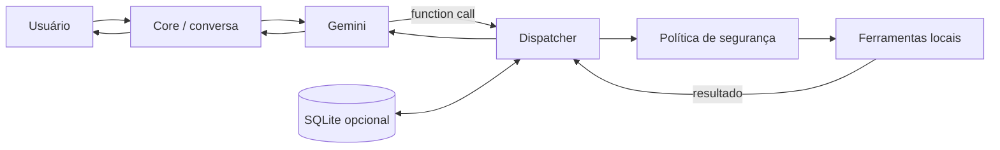

# Arquitetura

## Objetivo da edição pública

A versão original do J.A.R.V.I.S. cresceu como laboratório pessoal e possui integrações específicas do ambiente de desenvolvimento: voz bidirecional, interface gráfica, wake word, automação de desktop, visão, navegador, rotinas proativas e várias ferramentas de sistema.

Para o portfólio, o núcleo foi **refatorado para uma edição menor, reproduzível e segura por padrão**. O objetivo não é publicar cada detalhe do ambiente privado, e sim demonstrar as decisões de engenharia que sustentam o projeto.

## Fluxo



## Módulos públicos

```text
jarvis/
├── config.py      # variáveis de ambiente, XDG e defaults seguros
├── core.py        # cliente Gemini + loop de function calling
├── tools.py       # declarações + dispatcher + implementações
├── security.py    # política do shell
└── memory.py      # persistência SQLite opt-in
```

### `config.py`

Concentra toda configuração externa. Não existem chaves, IPs, nomes de usuário, caminhos de home ou credenciais fixas no código público.

O diretório de dados respeita `XDG_DATA_HOME` quando disponível e cai para `~/.local/share/jarvis-assistente`.

### `core.py`

Mantém o ciclo conversacional e o function calling. O modelo recebe somente as ferramentas expostas pela edição pública. Cada chamada volta ao dispatcher e o resultado é devolvido ao modelo antes da resposta final.

### `tools.py`

Mantém a separação entre descrição da ferramenta e implementação local. A versão pública começa com capacidades pequenas e auditáveis:

- informações de sistema;
- descoberta de aplicativos `.desktop`;
- abertura de executáveis presentes no `PATH`;
- memória local opcional;
- shell genérico opt-in.

### `security.py`

O shell fica desativado por padrão. Quando habilitado, há limites de tamanho e timeout, além de bloqueio explícito de padrões destrutivos conhecidos.

Isso não é apresentado como isolamento formal: blocklists não substituem sandbox, namespaces, containers ou políticas de sistema operacional.

### `memory.py`

Persistência SQLite local e opcional. A edição pública não salva conversas automaticamente e não cria banco enquanto a memória não for habilitada.

## Diferenças para o protótipo privado

| Aspecto | Protótipo privado | Edição pública |
|---|---|---|
| Gemini texto | sim | sim |
| Function calling | sim | sim |
| Memória | automática e ampla | mínima, opt-in |
| Shell | amplo com guardrails | desativado por padrão |
| GUI Tkinter | sim | não incluída no núcleo público |
| Gemini Live / áudio | sim | documentado, não incluído |
| Wake word | sim | documentado, não incluído |
| Visão / controle de tela | sim | não incluído |
| Automação de navegador | sim | não incluído |
| Rotinas proativas | sim | não incluído |
| Configurações pessoais | presentes no ambiente privado | removidas |

## Por que reduzir o escopo público?

Publicar um agente com acesso amplo ao desktop cria duas dificuldades: segurança e reprodutibilidade. A versão de portfólio mantém o ponto tecnicamente interessante — **LLM orquestrando ferramentas reais através de um dispatcher** — sem exigir que outra pessoa replique o computador do autor nem oferecer capacidades perigosas ligadas por padrão.

## Extensão futura

A arquitetura permite adicionar ferramentas sem modificar o loop central. Uma nova capacidade precisa de:

1. implementação local;
2. declaração de parâmetros;
3. registro no dispatcher;
4. testes;
5. análise de risco antes de habilitação.
